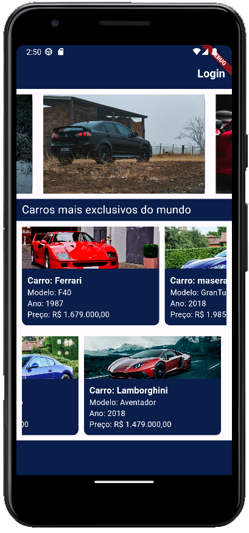
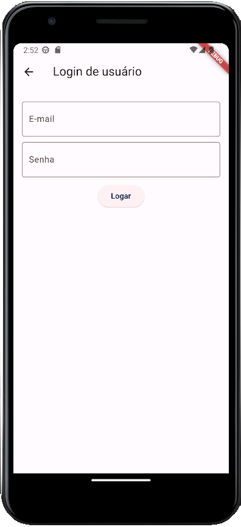
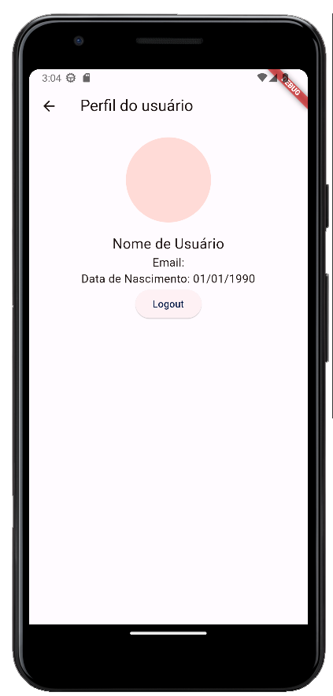

<div align="center">
  
</div>

# NitorXK

[](vitorcarvalho67/NitorXK/blob/master/LICENSE)     

This repository contains a mobile application built using Flutter, a popular cross-platform framework for creating beautiful and natively compiled applications. The app features initial screens that provide a seamless user experience, a user login interface for secure authentication, and a user profile page to display personalized information.

## How to use:

Clone the repository:
```bash
git clone
```

Install the dependencies:
```bash
flutter pub get
```

Run the app in mobile:
```bash
flutter run
```

## Client side:
https://github.com/VitorCarvalho67/NitorXK

 

## Server side:
https://github.com/VitorCarvalho67/API-GO


## Screenshots:
<div sytle="display: flex; flex-direction: row; justify-content: space-between;">



</div>

## Status:

**Work in Progress (WIP)**

This project is actively being developed. New features, enhancements, and improvements are regularly added. While it is functional, it may still have some rough edges. Feedback and contributions are welcome.

Please check back for updates and improvements as the project evolves.

## Contributing

Contributions to this project are welcome. Please follow these steps to contribute:

- Fork the repository.
- Create a new branch for your feature or bug fix.
- Commit your changes.
- Push to the branch.
- Submit a pull request

